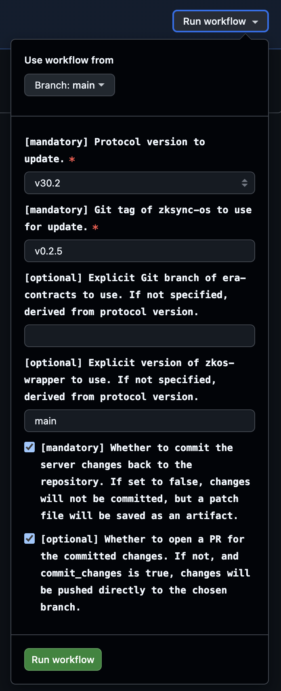

# Update verification keys

Updates [era-contracts](https://github.com/matter-labs/era-contracts)
repository with new set of verification keys generated
from the latest ZKsync OS binary and trusted setup.

```admonish title="Script path"
[https://github.com/matter-labs/zksync-os-scripts/blob/main/scripts/update_vk.py](https://github.com/matter-labs/zksync-os-scripts/blob/main/scripts/update_vk.py)
```

Use this script when you need to update verification keys for your contracts after a new ZKsync OS or contracts release.

Usually, the script is used by the protocol upgrade operator or automation to perform the protocol upgrade.

Script performs the following steps:
- Downloads the trusted setup (CRS) file
- Downloads the updated ZKsync OS binary for a specified release tag
- Generates a new SNARK verification key using the trusted setup and ZKsync OS binary
- Regenerates verifier smart contracts
- Produces updated Solidity verifier contracts for ZKsync OS
- Recomputes contracts hashes affected by the verifier changes

The script updates the following files in the [era-contracts](https://github.com/matter-labs/era-contracts) repository:

- `l1-contracts/contracts/state-transition/verifiers/ZKsyncOSVerifierPlonk.sol` - Plonk verifier contract
- `tools/verifier-gen/data/ZKsyncOS_plonk_scheduler_key.json` - Plonk verifier key data
- `AllContractsHashes.json` - recomputed contract hashes

[Here is an example of a successful commit](https://github.com/matter-labs/era-contracts/commit/9ddc915c85d1f44c79b5d55e160d384138ed5105) for the reference.

```admonish note

Commit example here is just for the reference.

The script itself does not perform any git operations (commit/push/PR creation).
It is expected that the caller (manual operator or automation) will handle
these operations after the script successfully completes.
```

---

## Local use

~~~admonish example title="Example usage"
```bash
REPO_DIR="/path/to/era-contracts" \
ZKOS_WRAPPER_PATH="/path/to/zkos-wrapper" \
ZKSYNC_OS_TAG=latest \
    uv run -m scripts.update_vk
```
~~~

To run the script, you will need:
- [General prerequisites including uv, Rust and NodeJS](../prerequisites.md)
- Specific release tag of ZKsync OS from [`zksync-os` releases](https://github.com/matter-labs/zksync-os/releases) specified through `ZKSYNC_OS_TAG` env variable

```admonish warning title="Protocol version and branches"

In addition, the script requires access to the following repositories,
which should be specified via corresponding path environment variables:

| Repository    | Env Variable        | Protocol version → Branch Mapping |
| :------------ | :------------------ | :----------------------- |
| [era-contracts](https://github.com/matter-labs/era-contracts) | `REPO_DIR`          | **v30.2** → `zksync-os-stable`<br />**v31.0** → `draft-v31-with-zksync-os` |
| [zkos-wrapper](https://github.com/matter-labs/zkos-wrapper)  | `ZKOS_WRAPPER_PATH` | **all versions** → `main` (latest) |

Please, additionally check [protocol compatibility](../protocol-compatibility.md) to ensure the correct versions are used.
```

---

## GitHub Actions

The script supports execution via GitHub Actions [`update-vk.yaml` workflow](https://github.com/matter-labs/zksync-os-scripts/blob/main/.github/workflows/update-vk.yaml)
that can be triggered manually via GitHub Actions UI interface.

```admonish title="Workflow link"
[https://github.com/matter-labs/zksync-os-scripts/actions/workflows/update-vk.yaml](https://github.com/matter-labs/zksync-os-scripts/actions/workflows/update-vk.yaml)
```

### Input parameters

| Name                   | Required | Description                                                    |
| ---------------------- | -------- | -------------------------------------------------------------- |
| `protocol_version`     | ✅       | Protocol version to update verification keys for.              |
| `zksync_os_tag`        | ✅       | Git tag of `zksync-os` used to generate the keys.              |
| `era_contracts_branch` | ❌       | Explicit `era-contracts` branch. Defaults to protocol mapping. |
| `zkos_wrapper_version` | ❌       | Explicit `zkos-wrapper` version. Defaults to protocol mapping. |
| `commit_changes`       | ❌       | Whether to commit the updated keys. Defaults to `true`.        |
| `open_pr`              | ❌       | Whether to open a PR. Defaults to `true`.                      |

<p align="center">
    
</p>

```admonish tip title="Configuring the workflow"
Follow more detailed tutorial in the [GitHub Actions guide](../github-actions.md).
```

### Outputs

On **successful runs**, the workflow uploads `contracts_<protocol_version>.patch` Git patch file with the changes made to the `era-contracts` repository.

If `commit_changes` and `open_pr` are set to `true`, a PR is opened automatically with the changes.

```admonish title="Example PR"
[era-contracts/pull/2018](https://github.com/matter-labs/era-contracts/pull/2018)
```

On **failed runs**, the workflow saves logs from the workspace `.logs` directory as an artifact.

```admonish tip
Artifacts can be downloaded directly from the workflow run page in GitHub Actions.
```

## Script dependencies

The script relies on the following external resources:
- [Trusted setup CRS file `setup_2^24.key`](https://storage.googleapis.com/matterlabs-setup-keys-europe/setup-keys/setup_2^24.key)
- ZKsync OS `multiblock_batch.bin` binary from [zksync-os releases](https://github.com/matter-labs/zksync-os/releases)
- [zkos-wrapper part to generate verification keys](https://github.com/matter-labs/zkos-wrapper/blob/main/docs/end_to_end.md?plain=1#L36)
- [Plonk and Flonk verifier contract generator](https://github.com/matter-labs/era-contracts/tree/zksync-os-stable/tools/verifier-gen)
- [`recompute_hashes.sh` script to recompute contract hashes after update](https://github.com/matter-labs/era-contracts/blob/zksync-os-stable/recompute_hashes.sh)


```admonish bug title="Script failure"
If the script fails, it means that one of the dependencies is changed or unavailable.
In this case, the script needs to be updated accordingly.

- CRS checksum mismatch → trusted setup file updated upstream
  - To fix: check with DevOps, and update the expected checksum in the script
- Contracts regeneration failure → incompatible tooling on the `era-contracts` branch
  - To fix: align new `era-contracts` tooling updates with the scripts

```
